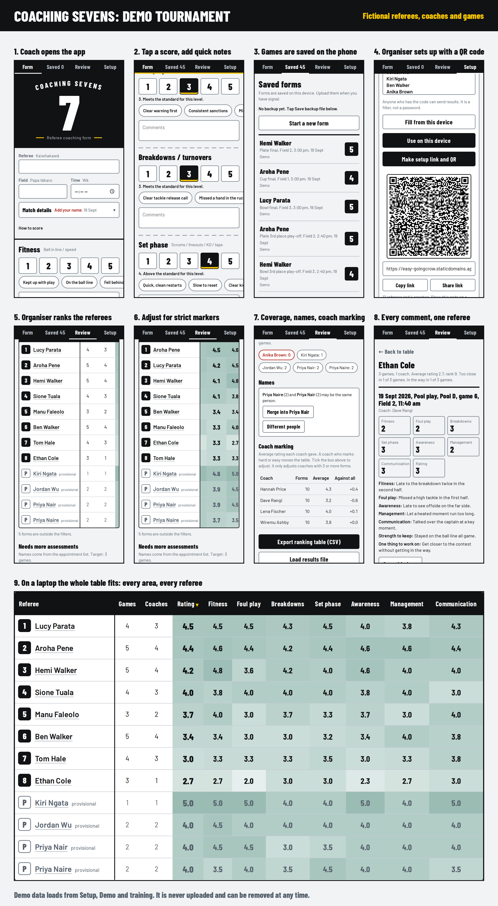

# Sevens Coaching Form

A phone app for rugby referee coaches at sevens tournaments. It began as a one-page Excel scoring sheet.
Coaches score a game, save it on the phone, and upload it. Organisers rank referees across many games and coaches.

It is a progressive web app: plain HTML, CSS and JavaScript, with no build step and no server code. It works offline.



## What it does

**Coaches**
- Score 8 areas from 1 to 5: fitness, foul play, breakdowns, set phase, game awareness, game management, communication, and an overall rating.
- Tap quick notes, add comments, and write "Strength to keep" and "One thing to work on".
- Write private notes that are left out of the summary, email and print.
- Dictate into any comment box: tap the microphone and speak, and the words are typed in. Say "full stop", "comma", "question mark" or "new line" for punctuation.
- Record a voice note in any comment box (the 8 areas, distance from contest, the two feedback boxes and private notes). Play it back, record again, delete it, or share it.
- Save on the device, upload with one tap, email or share a summary, print or save a PDF.
- Work offline. Forms wait on the phone until there is signal.
- Send feedback about the app from Setup. Goes straight to the organiser through static.app, separately from results upload.

**Organisers**
- Make a setup link and QR code with the tournament name, a tournament code, and lists of fields, levels, coaches and referees.
- Rank referees, with provisional marks for few games, coach marking style adjustment, a coverage list, and a name merge tool.
- Load a results file (CSV or JSON) and export the ranking as CSV.

**Demo**
- Setup, then Demo and training, loads 45 made-up games. Demo forms are never uploaded.

## Release notes

See [docs/RELEASE_NOTES.md](docs/RELEASE_NOTES.md) for what changed in each release, a troubleshooting table for support, and a data and privacy summary.

## Files

| Path | What it is |
| --- | --- |
| `index.html` | The whole app: page, styles and script |
| `sw.js` | Service worker for offline use |
| `manifest.webmanifest` | Install details |
| `icons/`, `fonts/` | App icons and the Barlow fonts (SIL Open Font License) |
| `lib/` | QR code maker and QR scanner. Loaded only when used. See `lib/LICENSES.txt` |
| `demo/` | Made-up tournament data: `demo.json`, plus a CSV and a backup file for testing |
| `tools/` | Scripts that make the demo data and the icons |
| `docs/` | Release notes and the demo overview picture |
| `.github/workflows/` | Deploys to static.app when you push to `main` |

## Run it on your computer

```
python3 -m http.server 8000
```

Open http://localhost:8000. Service workers and the camera work on `localhost`. Phones need HTTPS.

## Deploy

The site itself works on any static host, including GitHub Pages -- see "Upload results" below for the one feature
that currently still depends on which host you use.

1. Make a site at https://static.app and note its site id (`pid`), or turn on GitHub Pages for this repo (Settings, then Pages).
2. If using static.app: in this GitHub repo, open Settings, then Secrets and variables, then Actions.
3. Add the secret `STATICAPP_API_KEY`. Make a new key at https://static.app/account/api. Do not paste it in code, chat or issues.
4. Add the variable `STATICAPP_PID` with your site id.
5. Push to `main`. The workflow zips the site and uploads it.

The workflow changes the cache name in `sw.js` on each release, so phones pick up the new files after two opens.
If you deploy by hand, change `CACHE` in `sw.js` first.

## Upload results: on trial with SnapItForms

**Coaching-results uploads are on trial with [SnapItForms](https://snapitforms.com/), a small third-party form backend.**
It was picked because it works from any static host (GitHub Pages included), not because it has a track record --
at the time this was set up (Sept 2026), no independent review of it could be found anywhere (Capterra, G2, Reddit,
Hacker News, GitHub). Treat it as unproven. Watch real submissions closely, and be ready to move to a better-known
service (Formspree, Basin, Getform/Forminit) or an in-house option (Power Automate + SharePoint, an Azure Function)
if it does not hold up.

- The upload code (`uploadOne()` in `index.html`) posts straight to `https://api.snapitforms.com/submit` with `fetch`.
  No vendor script or hidden form is involved for this any more.
- `SNAPIT_ACCESS_KEY`, near the top of the script, must hold a real access key from your SnapItForms account
  (sign in with Google, then copy the key) before Upload will do anything. `node tools/check.js` fails on the
  placeholder value on purpose, so a deploy with no key configured is caught before it goes out.
- The key is not a secret in the usual sense -- a browser-only app cannot hide it -- but do not publicise it. Anyone
  who has it can send junk into your SnapItForms dashboard.
- If a submission fails for a reason other than "no signal" (SnapItForms down, a CORS block, a rejected key), the
  coach sees "Upload did not work. Try again." with no more detail. The form itself is never lost either way; it
  stays on the phone until it uploads.
- **The separate in-app feedback feature (Setup, then "Send feedback") still uses static.app**, unchanged. It is
  a distinct hidden form (`#fb-form`, `sevens-feedback`) and was not part of this trial.

## Results and data

- Each game is one submission in your SnapItForms dashboard. Export it from there as CSV.
- Feedback sent from Setup still goes to the static.app form named `sevens-feedback`. Read it in your static.app account.
- Whatever the upload backend, do not add or rename fields in `UP_FIELDS` (`index.html`) without a plan -- anyone
  exporting a CSV, or loading an older one, expects the column names to stay put. `node tools/check.js` catches an
  accidental change.
- Nothing in the app reads the results back live. Export the entries, then use Review, then Load results file.
- Forms live in each phone's browser storage. Tell coaches to save a backup file after each event.
- Voice notes are audio clips kept in the phone's IndexedDB. They are **not** uploaded (static.app forms carry text only) and are **not** in backup files. Share summary sends them with the text where the phone allows it. The email button cannot attach files. Clips are limited to 2 minutes (`VN_MAX` in `index.html`). For text the organiser can read, use the microphone on the phone keyboard.
- Deleting a form deletes its voice notes.
- Dictation uses the browser's Web Speech API (`SpeechRecognition`). **It sends the audio to the browser maker's speech service** (Google on Android Chrome, Apple on iPhone). It needs signal, shows a one-time warning, and can be switched off in Setup. It is hidden in browsers without the API (Firefox, and some iPhone Home Screen apps). Te reo Māori words often come out wrong. Voice notes are separate: they stay on the phone.
- Dictation and voice notes both use the microphone, so only one can run at a time.
- On iPhone, Safari and the Home Screen icon keep separate storage. Install first, then always open from the icon.
- The tournament code is a filter, not a password. Anyone who has it can send results.
- Results name real people. Keep the repo, exports and static.app account private, and follow your privacy rules (for example the NZ Privacy Act 2020).

## Change the content

- **Score wording:** `ANCHORS` at the top of the script in `index.html`.
- **Areas and quick notes:** the `SECTIONS` list.
- **Te reo Māori labels:** the `<i lang="mi">` tags in the form. Have a fluent speaker check them.
- **Colours and type:** the CSS variables at the top of the styles. There are light, dark and sun themes.
- **Demo data:** edit and run `python3 tools/generate_demo.py`.

## Checks and Claude Code

- `node tools/check.js` runs quick checks: scripts parse, manifest and cached files exist, the upload fields have not changed by accident, and no keys are in the files. The **Checks** workflow runs it on every pull request. The deploy workflow runs it first.
- `CLAUDE.md` holds the rules for Claude Code. It works on a branch and opens a pull request. You merge it, and the merge deploys.

## Tests

There is no test suite in the repo. The app was checked with Playwright on phone-size screens, an accessibility scan (axe),
a fake camera for QR scanning, a fake microphone for voice notes, a mock of `fetch` for SnapItForms uploads, and a mock of the
static.app form script for feedback and the speech service. Real speech recognition and a real SnapItForms submission have not
been tested. Add your own tests if you grow the app.

## Licence

No licence is set for the app code yet. Choose one before you make the repo public.
Third-party code and fonts keep their own licences (see `lib/LICENSES.txt` and `fonts/LICENSE.txt`).
